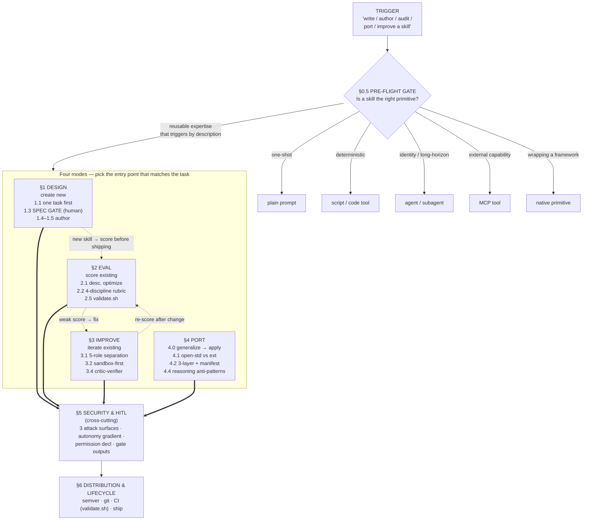

# Workflow — How the Four Modes Fit Together

High-level orientation for `meta-skill-author`. This is the map; `SKILL.md` is
the territory. Read this to understand *which mode to enter and how they hand off*;
read `SKILL.md` for the actual procedure inside each mode.

The skill is **one skill with four modes**, not four skills. Each mode is an
independent entry point — you jump into whichever matches the request — but all four
share one spine: the same `[finding-name]` corpus, the same four-discipline rubric
[four-discipline-prompt-evaluator], the same security/HITL wrapper, and the same
distribution lifecycle. That shared spine is *why* they live in one file. See
[When to split this into a routine](#when-to-split-this-into-a-routine) below for the
explicit criteria that would change that.

---

## The lifecycle at a glance (Mermaid)



---

## The lifecycle at a glance (ASCII fallback)

If your viewer does not render Mermaid, the same flow:

```
                        ┌─────────────────────────────────────────┐
                        │  TRIGGER: "write/author/audit/port/      │
                        │  improve a skill", "optimize description" │
                        └────────────────────┬────────────────────┘
                                             │
                        ┌────────────────────▼────────────────────┐
                        │  §0.5  IS A SKILL THE RIGHT PRIMITIVE?    │
                        │  (pre-flight gate — check FIRST)          │
                        │   one-shot? ──────────► plain prompt      │
                        │   deterministic? ─────► script / code     │
                        │   identity/long-horizon? ► agent          │
                        │   external capability? ► MCP tool         │
                        │   wrapping a framework? ► native primitive│
                        └────────────────────┬────────────────────┘
                              reusable, triggers-by-description
                                             │  → author a skill
   ┌──────────────────┬────────────────────┼────────────────────┬──────────────────┐
   ▼                  ▼                     ▼                    ▼                  │
┌────────────┐  ┌────────────┐      ┌────────────┐      ┌────────────┐            │
│ §1 DESIGN   │  │ §2 EVAL     │      │ §3 IMPROVE  │      │ §4 PORT     │           │
│ create new  │  │ score one   │      │ iterate one │      │ adapt target│          │
│ 1.1 one task│  │ 2.1 desc.   │      │ 3.1 5-role  │      │ 4.1 std vs  │          │
│ 1.3 SPEC    │─►│   optimize  │      │   separation│      │   extension │          │
│   GATE(human)│  │ 2.2 rubric  │      │ 3.2 sandbox │      │ 4.2 3-layer │          │
│ 1.4 frontmtr│  │ 2.3 3-tier  │      │   -first    │      │   portable  │          │
│ 1.5 body    │  │ 2.5 validate│      │ 3.4 critic- │      │ 4.4 reason. │          │
│             │  │   .sh       │      │   verifier  │      │   anti-pat. │          │
└─────┬──────┘  └─────┬──────┘      └─────┬──────┘      └─────┬──────┘            │
      └────────────────┴────────────────────┴────────────────────┴──────────────────┘
                                             │
                        ┌────────────────────▼────────────────────┐
                        │  §5  SECURITY & HITL  (cross-cutting)     │
                        │  3 attack surfaces · autonomy gradient ·  │
                        │  permission declaration · gate outputs    │
                        └────────────────────┬────────────────────┘
                                             │
                        ┌────────────────────▼────────────────────┐
                        │  §6  DISTRIBUTION & LIFECYCLE             │
                        │  semver · git · CI (validate.sh) → ship   │
                        └─────────────────────────────────────────┘
```

---

## How to read it

- **§0.5 is a gate, not a step.** The most-emphasized rule is to rule out plain
  prompts, scripts, agents, and MCP tools *before* authoring anything. Most
  authoring mistakes are building a skill for what should be a cheaper primitive
  [skill-as-new-employee-mental-model][code-as-deterministic-tool-inside-skills].
- **The four modes are entry points, not a strict sequence.** Jump into whichever
  matches the request: Design (new), Eval (score existing), Improve (iterate
  existing), Port (two-stage: generalize to `ports/generic.md`, then apply an
  `adapters/<platform>.md` profile to produce the platform port — stage 1 is a
  valid stopping point).
- **Solid arrows = how you ship; dashed arrows = how modes hand off.** A freshly
  designed skill flows into Eval before shipping; a weak Eval score routes into
  Improve; an Improve change re-enters Eval to re-score
  [capability-vs-regression-eval-lifecycle].
- **§1.3 Spec Gate is the hard human checkpoint** inside Design — no `SKILL.md` is
  generated until the spec is locked and approved
  [spec-first-agent-briefs-prompt-craft-context-inten].
- **§3.1's generator↔assessor separation is mandatory** in Improve — one role never
  both writes and grades the same artifact
  [generator-assessor-separation-in-skill-iteration].
- **§5 and §6 wrap every mode** — security/HITL and distribution apply no matter
  which entry point you used.

---

## The two-skill family

This skill does not work alone. It pairs with a sibling that keeps it from going
stale:

| Skill | Job | Cadence | Mutates user skills? |
|-------|-----|---------|----------------------|
| **`meta-skill-author`** (this) | Author / evaluate / improve / port skills | Per-skill, on demand | Yes — produces and edits `SKILL.md` files |
| **`helper-meta-skill-author`** (bundled helper) | Detect drift in the best-practices corpus, propose updates, apply approved ones back into this package | Periodic / on-demand / reactive | Only this package's own references — never your skills |

The refresher is **not** an open-web scout. It watches a *bounded* set of sources
(the local finding corpus plus a platform-docs watchlist) and runs Detect → Propose
→ Apply with generator-assessor separation and a rollback bundle
[generator-assessor-separation-in-skill-iteration][sandbox-first-modification-validation].
Open-ended discovery of brand-new patterns is a *separate* upstream concern; the
refresher's job is to fold confirmed changes into this package so the author skill's
guidance stays current.

---

## When to split this into a routine

Your instinct to ask "is this four skills?" is the right reflex — Anthropic's own
guidance says **structure for scale: split when `SKILL.md` grows unwieldy and keep
mutually exclusive paths separate** [skill-authoring-four-guidelines]. We have *not*
split, deliberately. Here is the decision rule so future-you can re-evaluate without
re-litigating it.

**Keep it one skill (current state) while ALL of these hold:**

- The four modes share one corpus, one rubric, and one security/distribution spine.
  Splitting would either duplicate that spine across files (citation-drift risk) or
  force a 5th "shared-core" skill plus a loader.
- `SKILL.md` stays under the 500-line cap without contorting content. The cap is the
  early-warning gauge: routine trimming is fine; *deleting load-bearing rules just to
  fit* is the signal something must move out.
- The target platforms reliably support multi-skill handoff. Single-skill
  mode-routing triggers everywhere; a multi-skill routine assumes cross-skill
  handoff that not every harness guarantees.

**Split into a routine of separate skills when ANY of these become true:**

- **One mode balloons past what a shared 500-line file can hold** and trimming would
  delete a rule that earns its place. That mode becomes its own skill; the others
  load it by reference.
- **A mode develops a genuinely different cadence or actor** — e.g. if Eval became a
  scheduled, unattended regression-gate run on a fixed interval rather than an
  on-demand author action. (This is exactly *why* the refresher is already a separate
  skill: different cadence, different actor, no mutation of user skills.)
- **Two modes stop sharing the spine** — if Port no longer needed the four-discipline
  rubric or the finding corpus, the coupling that justifies one file is gone.
- **A harness you must support cannot route internal modes** and forces one skill per
  invocable job.

**If you split, preserve the invariants** that currently make this package trustworthy:
every substantive claim stays finding-cited and resolvable in `SOURCES.md`; each
resulting skill stays portable across all five platforms; each passes
`scripts/validate.sh` independently; and the citation tokens (`[finding-name]`) are
treated as a shared vocabulary, *not* renamed per skill.

---

## See also

- `SKILL.md` — the procedure inside each mode.
- `README.md` — package contents and quick-start.
- `references/decision-sequence.md` — the authoring procedure and the hard design gate.
- `references/skill-smells.md` — 30-second symptom-to-cause triage before a full audit.
- `CHANGELOG.md` — version history / corpus-freshness surface.
