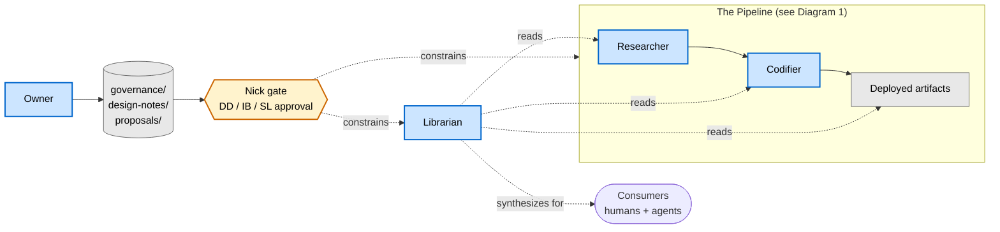

# Agent Interaction Model — Improvement Loop

How the four IL agents collaborate, and where Nick gates between stages.

## TL;DR

The IL has **four agents** with distinct roles and a **file-mediated** collaboration model — no agent invokes another agent directly. Nick is the orchestrator at every stage transition (DD-29).

- **Researcher** runs intake; writes raw findings.
- **Codifier** classifies (`/identify-artifacts`) and drafts staged artifacts (`/extract-artifacts`).
- **Librarian** is read-only; serves consumption queries from humans and agents.
- **Owner** governs the system; writes proposals that flow through Nick to become DDs / IB items / System Log entries.

---

## Diagram 1 — The Pipeline

Researcher → Codifier (two stages) → Nick deploys. Each handoff is a file-write; each transition is a Nick gate.

```mermaid
flowchart LR
    Sources([External Sources<br/>URLs · transcripts · arXiv])
    Dest([meta-system/knowledge/<br/>.claude/])

    Sources --> R[Researcher]
    R -- "research-findings/<br/>research-sources/<br/>pipeline_status: raw" --> G1{{Nick gate 1<br/>review findings}}
    G1 --> CI[Codifier<br/>/identify-artifacts]
    CI -- "operations/<br/>pattern-identification-reports/" --> G2{{Nick gate 2<br/>approve classifications}}
    G2 --> CE[Codifier<br/>/extract-artifacts]
    CE -- "extracts/<br/>pipeline_status: extracted" --> G3{{Nick gate 3<br/>review staged}}
    G3 --> ND[Nick deploys]
    ND --> Dest

    classDef agent fill:#cce5ff,stroke:#0066cc,stroke-width:2px,color:#000
    classDef gate fill:#fff3cd,stroke:#cc6600,stroke-width:2px,color:#000
    classDef nick fill:#d4edda,stroke:#28a745,stroke-width:2px,color:#000
    class R,CI,CE agent
    class G1,G2,G3 gate
    class ND nick

    click R "../../agents/researcher/agent.md" "Researcher agent definition"
    click CI "../../agents/codifier/agent.md" "Codifier agent definition"
    click CE "../../agents/codifier/agent.md" "Codifier agent definition"
```

The `pipeline_status` field on findings is the interface contract: Researcher sets `raw`; Codifier transitions to `extracted` (or `synthesized` for guide synthesis, not shown). Transitions are unidirectional — a finding never goes back to `raw`.

---

## Diagram 2 — Cross-Cutting Agents

Two agents sit *outside* the pipeline. **Librarian** reads from the pipeline and synthesizes answers for consumers; it never writes. **Owner** stewards the system — its output flows through Nick to become governance that constrains all other agents.

**Librarian resolution order.** When the same topic appears at multiple processing depths, the Librarian prefers the most refined form: (1) deployed artifact (Nick-approved) → (2) staged guide (Codifier-synthesized) → (3) raw finding (Researcher-created). Underlying evidence is cited regardless.

---

## How to Read

| Convention | Meaning |
|---|---|
| Blue rectangle | Agent |
| Yellow hexagon `{{ }}` | Nick gate (human-in-loop) |
| Green rectangle | Nick's direct action |
| Stadium `([ ])` | External boundary (sources or consumers) |
| Cylinder `[( )]` | File-substrate (directory/path) |
| Solid arrow | Write or trigger-next-stage |
| Dotted arrow | Read, govern, synthesize |
| Edge label | Substrate path or pipeline status |
| Click an agent node | Opens that agent's `agent.md` definition |

---

## The Four Agents in Brief

| Agent | Definition | Writes To | Reads From |
|---|---|---|---|
| Researcher | [`agents/researcher/agent.md`](../../agents/researcher/agent.md) | `research-findings/` · `research-sources/` · `research-authorities/` · `watched-libraries/` · `watched-blogs/` | External sources |
| Codifier | [`agents/codifier/agent.md`](../../agents/codifier/agent.md) | `operations/pattern-identification-reports/` · `extracts/` (incl. `extracts/guides/`) | `research-findings/` (read; metadata-only writes to `pipeline_status` and `consumed_by`) |
| Librarian | [`agents/librarian/agent.md`](../../agents/librarian/agent.md) | *(nothing — read-only)* | `research-findings/` · `extracts/guides/` · `meta-system/knowledge/` |
| Owner | [`agents/owner/agent.md`](../../agents/owner/agent.md) | `governance/` · `project-management/design-notes/` · `governance/proposals/` | All system state |

---

## Anti-Patterns

From [`agents/handoff-protocol.md`](../../agents/handoff-protocol.md#anti-patterns):

1. **Researcher classifying its own findings.** Sets `priority` / `evidence_strength` only — never form (pattern / skill / rule / template / agent).
2. **Codifier doing intake.** If a gap surfaces during synthesis, it goes in the guide report — not a new finding. Nick routes to Researcher.
3. **Librarian fixing gaps.** Reports the issue; never runs `/linkage-repair` or modifies files.
4. **Direct agent-to-agent triggers.** Nick orchestrates every stage transition (DD-29). No cascading autonomous actions.

---

## Generation Notes

| Field | Value |
|---|---|
| **Source of truth** | `agents/handoff-protocol.md` + per-agent `agent.md` + IL `CLAUDE.md` |
| **Format choice** | Mermaid (text-as-source, dual-audience: human-rendered, agent-parseable, lives next to prose) |
| **Why not interactive HTML** | Per `interactive-explanations-extend-linear-walkthroughs` (P2 finding): HTML wins where readers need to *play* with behavior in space/time. This artifact is *consulted*, not explored — and must be agent-readable as text. Mermaid clickable nodes recover the progressive-disclosure affordance (click a node → open the canonical `agent.md`). |
| **Regen cadence** | Rare — only when agent roster, pipeline stages, or substrate paths change. |
| **Sibling artifacts** | ✓ Target B: [`pipeline-trace.md`](pipeline-trace.md) (sequence + state diagrams) · ✓ Target C: [`ownership-map.md`](ownership-map.md) (3-layer matrix + system topology Mermaid) · Target A: DD graph (planned — last; refresh cadence highest) |
