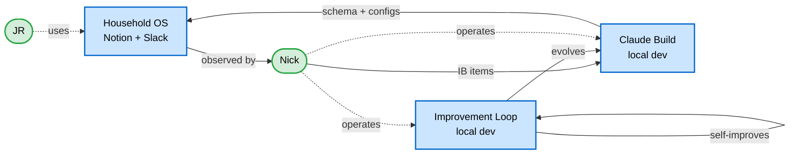

# Ownership / Boundary Map

Who's allowed to do what across the three systems and four IL agents, and where the gaps are. Largely tabular by intent — ownership data is matrix-shaped, not graph-shaped.

## TL;DR

Three layers of ownership in MetaSystem:

1. **System layer** — three systems (Household OS, Claude Build, Improvement Loop) with constitutional ownership and boundary rules. Source: [`constitution.md`](../../../meta-system/governance/constitution.md).
2. **Agent layer (within IL)** — four agents with read/write boundaries on KB substrate. Source: [`handoff-protocol.md`](../../agents/handoff-protocol.md) + agent definitions.
3. **Governance layer** — Design Decisions distributed across systems by `target_system`. Source: per-system `project-management/design-decisions/`.

Each table answers a different "who's allowed to…" question. The DD-corpus shape at the end shows where governance density lives.

---

## Layer 1 — System Layer (Constitutional Ownership)

From the constitution. Three systems have distinct lifecycle owners across four phases:

| System | Created by | Operated by | Maintained by | Evolved by |
|---|---|---|---|---|
| **Household OS** | Claude Build (schema + configs) | Custom Agents + Nick + JR | Nick + Claude Build | Claude Build (via IB items from Nick) |
| **Claude Build** | Nick (vault setup) | Nick via Cursor | Nick + Improvement Loop | Improvement Loop + Nick |
| **Improvement Loop** | Nick | Nick + Agents | Nick | Self-improving via research cycle |

### Constitutional Boundary Rules

1. **Household OS cannot modify schema.** No creating databases, properties, or views. Schema-write is a Claude Build exclusive.
2. **Schema changes flow through Claude Build** via Build Specs + Review Gates.
3. **Nick is the bridge** between Household OS and Claude Build. No automated feedback loop.
4. **JR's interface is Household OS only** (Notion + Slack). Git read-access for vault browsing; does not operate Claude Build.

### System Boundary Topology

The three systems and Nick-as-bridge:



Solid edges = automated / system-to-system flow. Dotted edges = human-mediated.

---

## Layer 2 — Agent Layer (IL Read/Write Boundaries)

From the post-2026-05-24 [`handoff-protocol.md`](../../agents/handoff-protocol.md) amendments and per-agent definitions:

| Agent | Writes To | Reads From | Cross-Agent Write Permission |
|---|---|---|---|
| **Researcher** | `research-findings/`, `research-sources/`, `research-authorities/`, `watched-libraries/`, `watched-blogs/` | External sources | None — never modifies another agent's output |
| **Codifier** | `operations/pattern-identification-reports/`, `extracts/` (incl. `extracts/guides/`) | `research-findings/` (read) | **Metadata-only:** may set `pipeline_status` and `consumed_by` on findings (Researcher-owned). Never modifies content. |
| **Librarian** | *(nothing — read-only)* | `research-findings/`, `extracts/guides/`, `meta-system/knowledge/` | None |
| **Owner** | `governance/`, `project-management/design-notes/`, `governance/proposals/` | All IL state + constitution + cross-system DDs | None directly — proposals gate through Nick to become DD / IB / SL |

### Skills Per Agent

For the per-skill table by agent — with category, boundary rule, and which `pipeline_status` each skill sets — see [`handoff-protocol.md`](../../agents/handoff-protocol.md) "Skill-to-Agent Mapping."

---

## Layer 3 — Governance Layer (DD shape)

Where governance density lives. Per `.claude/rules/governance.md` ("no hardcoded counts"), exact counts are deliberately not persisted here — they drift session-to-session and create maintenance debt. To produce the current shape on demand:

```bash
# DD shape by target_system × scope_category × status
for sys in improvement-loop meta-system; do
  echo "--- $sys ---"
  for f in systems/$sys/project-management/design-decisions/*.md; do
    awk '/^target_system:/{ts=$0} /^scope_category:/{sc=$0} /^status:/{st=$0} END{print ts" | "sc" | "st}' "$f"
  done | sort | uniq -c | sort -rn
done
```

### What the Shape Tells Us (structural, not transient)

These observations describe how the two governance corpora **divide cognitive labor**. They should hold across normal corpus growth; only substantial structural shifts (a new scope_category becoming dominant, a system's role redefining) would invalidate them.

- **Cross-system carries the philosophy.** Principles, fractal pattern, vocabulary, governance-distribution rules live in `meta-system`. IL inherits rather than restates.
- **IL carries the procedural specifics.** Research-to-codification flow, gate conventions, calibration, pipeline-status semantics — Process DDs cluster here because that's where the verbs live.
- **Structure dominates early governance** in both systems. Most foundational work has gone into *where things live* and *how they're shaped*. Expected to slow as the structure settles.
- **`Data Integrity` is IL-only.** Cross-system has no equivalent category — possibly absorbed into Structure or Flow at that level.
- **`Infrastructure` is cross-system only.** IL inherits these.

Read these as a load-bearing complementarity argument: cross-system sets *what to think with*; IL sets *how to operate*.

---

## Observed Drift

Found while compiling this map (Nick gate on remediation):

1. **`target_system` case inconsistency.** A subset of DDs in each system uses lowercase kebab (`"improvement-loop"`, `"cross-system"`); the remainder uses Title Case (`"Improvement Loop"`, `"Cross-System"`). Schema-level normalization needed — pick one form, sweep the rest. Suggested: lowercase-kebab is more programmer-friendly and matches the directory name; Title Case reads better as prose. Either works; pick one.
2. **`scope_category` enum is unclear.** Seven distinct values observed: `Structure`, `Process`, `Component`, `Flow`, `Principle`, `Data Integrity`, `Infrastructure`. No single source enumerates the canonical list (should be `_schema.yaml`; not verified). Without an enum, new DDs can drift to ad-hoc categories.
Neither is urgent. Both would close cleanly in a single sweep session.

*(Resolved in session 87: hardcoded skill counts in IL CLAUDE.md and `handoff-protocol.md` section headers were stripped per the no-hardcoded-counts rule.)*

---

## Conventions Inherited from Siblings

Output path, frontmatter shape, format-choice rationale, color/shape conventions, and click-target patterns: see [`agent-interaction-model.md`](agent-interaction-model.md#how-to-read).

**This artifact introduces no new Mermaid conventions.** Ownership data is matrix-shaped; tables are the primary form. The single Mermaid (system topology) reuses D's color/shape conventions.

---

## Generation Notes

| Field | Value |
|---|---|
| **Source of truth** | Constitution (system layer) · `handoff-protocol.md` (agent layer) · DD frontmatter scan (governance layer) |
| **Drift flagged** | Yes — `target_system` case inconsistency · `scope_category` enum unverified |
| **Regen trigger** | System boundary change · constitution amendment · agent roster or substrate change · substantial DD-corpus shift |
| **Siblings** | [`agent-interaction-model.md`](agent-interaction-model.md) · [`pipeline-trace.md`](pipeline-trace.md) |
| **Planned siblings** | Target A: DD graph (last — refresh cadence highest, depends on `title:` slug backfill being done first for compact node labels) |
