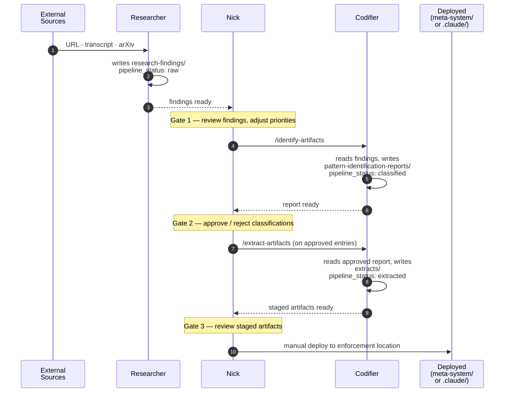
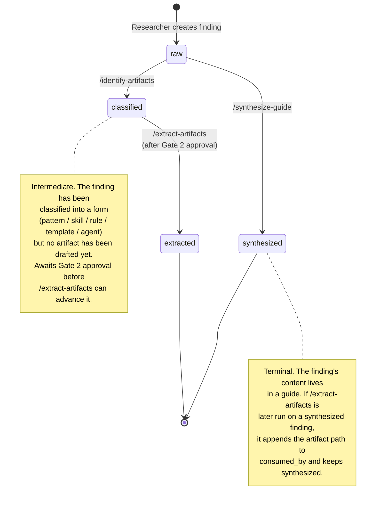

# Pipeline Trace — Life of a Finding

What actually happens when a research signal moves through the Improvement Loop, from external source to deployed artifact.

## TL;DR

A finding has a **5-step journey** and a **4-state lifecycle**. The journey is *who does what when* — best seen as a sequence. The lifecycle is *what state the finding is in* — best seen as a state machine. Both diagrams describe the same process from different angles.

- Diagram 1 answers: *what happens, in time?*
- Diagram 2 answers: *what state is the finding in, and how does it transition?*

Sibling: [`agent-interaction-model.md`](agent-interaction-model.md) covers the static collaboration model (who reads what, where humans gate). This artifact covers the dynamic — what *actually happens* when work flows through.

---

## Diagram 1 — What Happens, In Time

A generic finding's lifeline from external source through deployment. Numbers are message order; `Note over Nick` blocks mark human gates (one annotation per gate).



**Reading guide.**
- Solid arrow `->>` = a write or trigger.
- Dashed arrow `-->>` = a "ready" signal (Nick discovers completion).
- Self-arrow on R / C = the file-substrate write (the actual handoff carrier — no agent-to-agent message; the next agent reads the file).
- `Note over N` blocks = Nick gates. Each gate is one annotation per Nick's request; the actions inside the gate (review, approve/reject, route) are documented in the agent definitions, not this diagram.

---

## Diagram 2 — What State, And How It Transitions

`pipeline_status` is the finding's lifecycle field. Each state is set by exactly one skill; terminal states (`extracted`, `synthesized`) mean the finding's content has been consumed into a downstream artifact.



**Reading guide.**
- `[*]` = initial / terminal pseudo-state (nothing existed; or the finding has been consumed).
- Edge labels name the skill that performs the transition.
- Two paths from `raw`: via classification (`/identify-artifacts` → `/extract-artifacts`) or via direct synthesis (`/synthesize-guide`). Both are valid; the choice is made by Codifier on Nick's gate.

---

## Pipeline-Status Population

Per `.claude/rules/governance.md` ("no hardcoded counts"), exact counts are deliberately not persisted here. To produce the current shape on demand:

```bash
grep -h "^pipeline_status:" systems/improvement-loop/research-findings/*.md \
  | sort | uniq -c | sort -rn
```

### What the Shape Tells Us (structural, not transient)

- **The synthesis pathway has been the dominant terminal.** The `synthesized` state holds many more findings than `extracted`. The corpus has been routed primarily into guides, not standalone artifacts.
- **`classified` accumulates as a backlog signal.** It's transient in principle but persistent in practice — each finding sitting there is either awaiting Gate 2 approval, or was classified and never advanced. Growth in `classified` is the canonical IL backlog indicator.
- **Quoted vs unquoted YAML values exist for the same status.** A subset of findings use quoted strings (`"raw"` etc.) instead of bare scalars. KB-hygiene concern; see *Observed Drift*.

---

## Observed Drift

> ⚠ `agents/handoff-protocol.md` is incomplete vs. observed reality.

The protocol's transition table documents **3** `pipeline_status` values (`raw`, `synthesized`, `extracted`) and shows direct transitions from `raw` to either terminal. The actual state machine has **4** values; `classified` is an intermediate state on the extraction pathway, set by `/identify-artifacts` (skill line 468) before `/extract-artifacts` advances it to `extracted`.

**Suggested resolution** (Nick gate required):
- Amend `agents/handoff-protocol.md` transition table to include `classified`, with the edge `raw → classified` set by `/identify-artifacts`.
- Add the precedence rule from `/extract-artifacts` (line 648): if a finding is already `synthesized`, keep it and append to `consumed_by` rather than overwriting to `extracted`.
- Decide policy on quoted-YAML entries (`"raw"`, `"classified"`, `"synthesized"`) — accept as-is, or normalize to unquoted.

Not a DD-level change; an IB item or one-line amendment to the protocol doc would close it.

---

## Substrate Inventory

What gets written to where, per stage:

| Stage | Writer | Substrate | Sets `pipeline_status` |
|---|---|---|---|
| Intake | Researcher | `research-findings/<slug>.md` (+ `research-sources/`, `research-authorities/`) | `raw` |
| Identification | Codifier | `operations/pattern-identification-reports/<report>.md` | `classified` (on listed findings) |
| Extraction | Codifier | `extracts/<form>/<slug>.md` | `extracted` (on consumed findings) |
| Synthesis | Codifier | `extracts/guides/<guide>.md` | `synthesized` (on consumed findings) |
| Deploy | Nick | `systems/meta-system/knowledge/` or `.claude/` | *(no status change — `extracted`/`synthesized` already terminal)* |

The deploy step doesn't change `pipeline_status`. Deployment is observable elsewhere (artifact frontmatter has `deployed: true` and `deployed_to:` path).

---

## Conventions Inherited from Sibling

Color / shape / click conventions, output path, format choice, and regen cadence: see [`agent-interaction-model.md`](agent-interaction-model.md#how-to-read) "How to Read" and "Generation Notes." Not duplicated here.

**This artifact introduces two new conventions:**
- **`sequenceDiagram` for behavior-in-time.** When the question is *what happens when*, sequence wins. Use generic actors (a Researcher, a finding) over named specifics unless the artifact is a post-mortem.
- **`stateDiagram-v2` for lifecycle fields.** When a frontmatter field has discrete values with skill-driven transitions, model it as states. `[*]` is the canonical initial/terminal pseudo-state.

---

## Generation Notes

| Field | Value |
|---|---|
| **Source of truth** | `agents/handoff-protocol.md` + `identify-artifacts/SKILL.md` + `extract-artifacts/SKILL.md` + KB observation |
| **Drift flagged** | Yes — protocol doc lists 3 states; reality has 4. See *Observed Drift* above. |
| **Regen trigger** | New pipeline stage · new `pipeline_status` value · skill ownership change for any existing transition |
| **Sibling** | [`agent-interaction-model.md`](agent-interaction-model.md) — collaboration / authority view |
| **Siblings** | [`agent-interaction-model.md`](agent-interaction-model.md) · [`ownership-map.md`](ownership-map.md) |
| **Planned siblings** | Target A: DD graph (refresh cadence highest, do last) |
