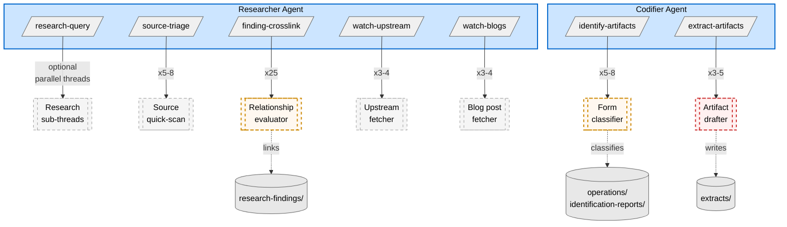

# Subagent Topology — Improvement Loop

Which workflow steps spawn subagents, what those subagents do, and where prompt quality matters most.

## TL;DR

7 of the IL's skills spawn subagents. The three heaviest — `/extract-artifacts`, `/identify-artifacts`, `/finding-crosslink` — account for the bulk of subagent invocations and are the primary targets for prompt quality monitoring. The remaining four use subagents for lightweight parallel fetches.

---

## How to Read

Inherits conventions from the [session 87 docs](../2026-05-24/agent-interaction-model.md#how-to-read). Additions:

| Convention | Meaning |
|---|---|
| Double-bordered rectangle `[[ ]]` | Subagent (spawned, not persistent) |
| Red dashed border | High prompt-sensitivity — subagent output directly becomes a file artifact |
| Orange dashed border | Medium prompt-sensitivity — subagent output feeds classification/linking decisions |
| Gray dashed border | Low prompt-sensitivity — subagent does mechanical fetch/compare |
| Batch size annotation | `xN` on edge = batch size per invocation |

---

## Diagram — Subagent Spawning Map

---

## Subagent Detail Table

| Skill | Agent | Batch Size | Subagent Task | Output Format | Prompt Sensitivity | Why |
|-------|-------|-----------|---------------|---------------|-------------------|-----|
| `/extract-artifacts` | Codifier | 3-5 | Draft artifact body + ContractSpec + ContextSpec | JSON | **High** | Output *is* the artifact — drafter quality = artifact quality |
| `/identify-artifacts` | Codifier | 5-8 | Classify finding into form (pattern/skill/rule/template/agent) | JSON | **Medium** | Misclassification routes artifact to wrong form; caught at review gate |
| `/finding-crosslink` | Researcher | 25 | Evaluate relationship pair (enables/contradicts/extends/same-problem) | JSON | **Medium** | False links degrade KB navigation; false negatives lose connections |
| `/source-triage` | Researcher | 5-8 | Quick-scan source, estimate finding density, verdict | Structured | **Low** | Triage is a pre-screen — wrong verdict means a source gets re-evaluated later |
| `/watch-upstream` | Researcher | 3-4 | Fetch latest version/changelog, compare against snapshot | Structured | **Low** | Mechanical fetch + diff; errors are visible in the triage report |
| `/watch-blogs` | Researcher | 3-4 | Fetch recent posts, triage for finding density | Structured | **Low** | Same as watch-upstream — fetch + compare + verdict |
| `/research-query` | Researcher | Optional | Parallel sub-research on independent threads | Freeform | **Low** | Only used when topic naturally decomposes; results merged by orchestrator |

---

## Prompt Quality Monitoring Priorities

Based on the sensitivity analysis above:

### Tier 1 — Monitor actively

**`/extract-artifacts` drafter subagent.** The subagent prompt template is in the SKILL.md procedure section. It instructs subagents to produce JSON with `body`, `contractspec`, and `contextspec` fields. Quality failures here directly produce bad artifacts. The orchestrator validates JSON structure but not semantic quality.

What to watch:
- Are drafted artifacts faithful to the source findings?
- Do ContractSpec/ContextSpec fields follow DD-78 and DD-92?
- Is the artifact at the right abstraction level (not too specific, not too vague)?

### Tier 2 — Spot-check periodically

**`/identify-artifacts` classifier subagent.** Classifies findings into forms using the Form Router rubric. Misclassifications are caught at the Nick gate (Gate 2) but add review burden.

**`/finding-crosslink` evaluator subagent.** Evaluates relationship pairs against binary tests. False positives add noise to `related_findings`; false negatives lose connections. Both are correctable but tedious at scale.

### Tier 3 — Low concern

**`/source-triage`, `/watch-upstream`, `/watch-blogs`, `/research-query`** — these subagents do mechanical fetch-and-compare work. Their prompts are simpler and their outputs are intermediate (triage reports, not final artifacts).

---

## Skills Without Subagents

For completeness, these skills have `Agent` in their `allowed-tools` but do **not** spawn subagents during normal operation:

| Skill | Why Agent is listed | Actual usage |
|-------|--------------------|----|
| `/perplexity-research` | Perplexity MCP tools | Uses Perplexity directly, not Agent |
| `/synthesize-guide` | LLM judgment calls | Inline judgment (split-trigger detection, harvest scan), not subagent orchestration |

---

## Generation Notes

| Field | Value |
|---|---|
| **Source of truth** | Per-skill `SKILL.md` files (procedure sections contain subagent prompt templates) |
| **Complements** | [`skill-artifact-map.md`](skill-artifact-map.md) (what skills write) · [`agent-interaction-model.md`](../2026-05-24/agent-interaction-model.md) (pipeline flow) |
| **Regen cadence** | On subagent usage change in any skill, batch size adjustment, or model profile change |
